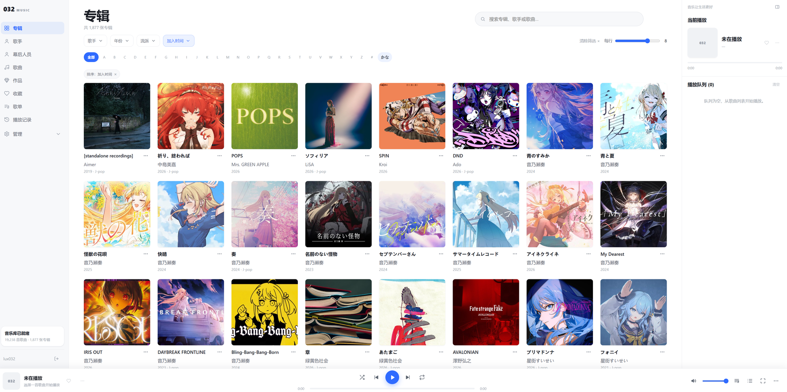

<p align="center"></p>

# 032 Music Server

[简体中文](README.md) | **English**

A self-hosted music library and streaming server built with Go. Local tags and manual edits come first, with an album-focused web interface and a JSON API for companion clients.

**Japanese ACG first:** metadata matching and work associations are designed primarily for Japanese anime, games, and doujin music. Japanese titles, kana indexes, and reading/sort tags are supported. Matching ordinary films and TV dramas is outside the project's primary scope.

## Preview



## Features

- **Local library:** incremental scanning on startup, automatic incremental scans when the music directory changes, manual incremental/full scans, progress and failure reporting, multi-disc albums, and detection of changed or missing files.
- **Audio and tags:** FLAC, MP3, M4A/MP4, AAC, Ogg/OGA, and Opus; duration, audio properties, artist credits, and local lyrics.
- **Browse and edit:** albums, album artists, track artists, creators, tracks, works, and series; search, filters, kana indexes, favorites, and playlists. Manual metadata overrides survive rescanning without rewriting music files.
- **Web player:** persistent player across in-app navigation, playback queue, shuffle/repeat, full-screen now-playing view, lyrics, playback progress, and history. The current administration UI is primarily Chinese; the English README does not change the UI language.
- **Media delivery:** original-file streaming with HTTP Range, live MP3/Opus transcoding, cached FLAC transcoding, cover thumbnails, and separate media credentials for players that cannot send API headers.
- **Images:** embedded artwork with folder-image fallback; cached artist images and work posters; custom album/artist image uploads stored in the data directory.
- **Optional enrichment:** MusicBrainz/Last.fm artist identity and biographies, Bangumi album/track/work associations and series suggestions, review queues, and reversible artist merges.
- **Client API:** capabilities, cursor-based library synchronization, favorites, playlists, playback reports, metadata-based similar tracks, and track paths.
- **Operations:** SQLite with WAL and automatic embedded migrations, admin sessions with CSRF protection and login rate limiting, credential rotation/recovery, health checks, graceful shutdown, Docker and Compose.

## Deploy with Docker Compose (recommended)

The included `compose.yaml` **builds the image from this checkout**. It is not configured to pull a prebuilt image. The runtime image includes ffmpeg and runs as a non-root user.

### 1. Prerequisites and checkout

Install Git and Docker with the Compose v2 plugin (`docker compose`). On Windows/macOS, use Docker Desktop with Linux containers. Ensure Docker can access the music folder (including drive/file-sharing permissions on Docker Desktop).

```sh
git clone https://github.com/lux032/032music-server.git
cd 032music-server
docker compose version
```

Copy the configuration template:

```sh
# Linux / macOS
cp .env.example .env
```

```powershell
# Windows PowerShell
Copy-Item .env.example .env
```

### 2. Set paths and credentials

Edit `.env`; replace **all placeholder credentials**. For example:

```dotenv
MUSIC_SERVER_PORT=4533
MUSIC_SERVER_DATA_PATH=./data
MUSIC_SERVER_MUSIC_PATH=/srv/music
MUSIC_SERVER_LIBRARY_NAME=My Music
MUSIC_SERVER_ADMIN_USERNAME=admin
MUSIC_SERVER_ADMIN_PASSWORD=YOUR_UNIQUE_PASSWORD_AT_LEAST_12_CHARACTERS
MUSIC_SERVER_API_TOKEN=YOUR_RANDOM_API_TOKEN_AT_LEAST_24_CHARACTERS
MUSIC_SERVER_MEDIA_TOKEN=YOUR_DIFFERENT_RANDOM_MEDIA_TOKEN_AT_LEAST_24_CHARACTERS
MUSIC_SERVER_COOKIE_SECURE=false
```

- `MUSIC_SERVER_MUSIC_PATH` is an **existing host folder**, mounted read-only at `/music`. On Windows, prefer forward slashes, e.g. `D:/Music`.
- `MUSIC_SERVER_DATA_PATH` is a **persistent, writable host folder**, mounted at `/data`. It contains the database, settings, playlists, history, and generated images/caches. Do not store it inside the music folder.
- Set a unique password of at least 12 characters and **two different random tokens** of at least 24 characters. Do not enable development mode in production. Keep `.env` private; do not commit it.
- Generate each token separately, for example with `openssl rand -hex 24` on Linux/macOS, or the following PowerShell command:

```powershell
[Convert]::ToHexString([Security.Cryptography.RandomNumberGenerator]::GetBytes(24)).ToLowerInvariant()
```

The PowerShell example requires PowerShell 7. The generated hexadecimal values are also suitable for tokens set through the security page.

### 3. Prepare Linux bind-mount permissions

The container's non-root user needs write access to `/data` and read/traverse access to `/music`. If your Linux host directory is not already writable by the container user, determine the UID/GID from the built image instead of assuming a fixed ID:

```sh
mkdir -p ./data
docker compose build
docker compose run --rm --no-deps --entrypoint id music-server
# Use the numeric UID/GID printed above; adjust the path if DATA_PATH differs.
sudo chown -R <UID>:<GID> ./data
```

Replace `<UID>` and `<GID>` before running `chown`. Only change ownership of the intended application data folder, not the whole music library. For NAS/network mounts, check ACLs as well. SELinux hosts may require an appropriate bind-mount label.

### 4. Start and verify

```sh
docker compose up -d --build
docker compose ps
docker compose logs --tail=100 music-server
```

Open:

- Admin / web player: `http://localhost:4533/admin`
- Public health check: `http://localhost:4533/api/v1/health`

From another device, replace `localhost` with the server's IP or hostname. Log in with the credentials from `.env`. Startup automatically launches an incremental scan; watch its progress on the dashboard. A healthy HTTP endpoint does **not** mean the initial scan has finished.

```sh
curl --fail http://localhost:4533/api/v1/health
curl --fail -H 'Authorization: Bearer YOUR_API_TOKEN' \
  http://localhost:4533/api/v1/status
```

PowerShell equivalent:

```powershell
Invoke-RestMethod -Uri http://localhost:4533/api/v1/health
Invoke-RestMethod -Uri http://localhost:4533/api/v1/status `
  -Headers @{ Authorization = 'Bearer YOUR_API_TOKEN' }
```

These examples require the **actual configured token**. Compose's `.env` file does not automatically populate your terminal's environment variables.

### 5. Apply configuration changes

Compose uses `.env` for substitution, but **does not automatically forward every variable to the server**. Only variables listed in `compose.yaml` under `environment` reach the container. For an advanced setting, add a mapping, for example:

```yaml
# Add these under services.music-server.environment:
MUSIC_SERVER_TRUSTED_PROXIES: "${MUSIC_SERVER_TRUSTED_PROXIES:-}"
MUSIC_SERVER_THUMB_CACHE_MB: "${MUSIC_SERVER_THUMB_CACHE_MB:-512}"
MUSIC_SERVER_BANGUMI_INTERVAL_MS: "${MUSIC_SERVER_BANGUMI_INTERVAL_MS:-500}"
MUSIC_SERVER_WORK_POSTER_BACKFILL: "${MUSIC_SERVER_WORK_POSTER_BACKFILL:-true}"
```

Then recreate the service:

```sh
docker compose up -d
```

`docker compose restart` alone does not apply changed container environment variables. Keep `/music`, `/data`, and the internal port `4533` unchanged unless you also adjust the mounts, port mapping, and health check.

### HTTPS and reverse proxy

The server itself serves HTTP. For public access, put it behind an HTTPS reverse proxy; do not expose an unencrypted admin login to the internet.

- Set `MUSIC_SERVER_COOKIE_SECURE=true` for HTTPS. Leave it `false` for direct HTTP, or the browser will not send the login cookie.
- Proxy the site at the domain root, preserving the `/admin` and `/api/v1` paths, Range headers, and long-running audio streams.
- If the proxy is on the host, you can restrict the Compose port mapping to `127.0.0.1:${MUSIC_SERVER_PORT:-4533}:4533`.
- Add `MUSIC_SERVER_TRUSTED_PROXIES` to Compose's `environment` and set it to the actual proxy IP/CIDR. Only trust proxies that correctly overwrite/append `X-Forwarded-For`; never trust `0.0.0.0/0` or arbitrary client networks. Without this setting, failed logins from all proxied users share the proxy's IP rate limit.
- Forwarded addresses must be plain IPs without ports. The server walks `X-Forwarded-For` from right to left only when the connection peer is trusted. This setting currently affects login rate limiting, not TLS termination.
- Media URLs contain credentials: avoid recording query strings in reverse-proxy access logs.

### Backups and upgrades

Back up `.env` and the **entire data directory**, not just `music.db`. The database contains credential overrides and external-service secrets; protect backups accordingly. With SQLite WAL, copying only the database while the server is running may omit recent writes. The simplest consistent backup is made while the service is stopped:

```sh
docker compose stop
# Back up .env and your configured MUSIC_SERVER_DATA_PATH now.
# Linux/macOS example for the default ./data path:
tar -czf music-server-backup.tar.gz .env data
docker compose start
```

For upgrades, first make a stopped backup, then:

```sh
git pull --ff-only
docker compose up -d --build
docker compose logs --tail=100 music-server
```

Database migrations run automatically at startup. Do not assume an older binary can read an upgraded database; restore the pre-upgrade data backup if a rollback is needed. Music files are never modified, moved, or deleted by the server. Changing the library root can change how files are indexed; keep mount paths stable across upgrades.

### Troubleshooting

| Symptom | Check |
|---|---|
| Compose says a required variable is missing | Run in the repository directory, create `.env`, and set the password, both tokens, and music path. |
| Startup rejects the password/token | Password must be at least 12 characters; tokens at least 24. Template placeholders are not secure credentials. |
| `permission denied` / database cannot be opened | Check data-folder ownership, music-folder read/traverse permissions, Docker Desktop sharing, and NAS ACLs. |
| Library is empty | Verify the host path, supported file extensions, and dashboard scan errors. An incorrect bind path can mount an empty directory. |
| Login repeatedly returns to the login page | Do not use secure cookies over plain HTTP; check proxy/cookie configuration. |
| Editing `.env` has no effect | Ensure Compose forwards the variable and recreate the container. Stored security-page overrides take precedence over environment credentials. |
| Media returns 401 | Use the **media token**, not the API token. Rotation invalidates old URLs; an unset media token outside development mode is randomly regenerated on each startup. |
| Transcoding returns 503 | Check `/api/v1/capabilities`, ffmpeg and its encoders, logs, and concurrency limits. Native installs need ffmpeg installed separately. |
| Audio format does not play in the browser | Original streaming depends on browser codec support; use a supported client or a transcode endpoint. |
| Online enrichment stops with rate limiting | Wait and retry; do not lower request intervals to bypass upstream limits. |

## Configuration reference

These are **server process variables**, unless marked “Compose only”. Native execution reads environment variables; it does not load `.env` itself.

| Variable | Default | Meaning |
|---|---|---|
| `MUSIC_SERVER_PORT` | `4533` | Compose only: published host port. |
| `MUSIC_SERVER_DATA_PATH` | `./data` | Compose only: host data folder. |
| `MUSIC_SERVER_MUSIC_PATH` | required in Compose | Compose only: host music folder. |
| `MUSIC_SERVER_ADDRESS` | `:4533` | HTTP listen address. |
| `MUSIC_SERVER_DATA_DIR` | `/data` | Writable server data directory. |
| `MUSIC_SERVER_DATABASE_PATH` | `<DATA_DIR>/music.db` | SQLite database path. |
| `MUSIC_SERVER_MUSIC_DIR` | `/music` | Server-side music root. |
| `MUSIC_SERVER_LIBRARY_NAME` | `Music` | Library display name. |
| `MUSIC_SERVER_ADMIN_USERNAME` | `admin` | Initial/fallback admin username. |
| `MUSIC_SERVER_ADMIN_PASSWORD` | required | At least 12 characters outside development mode. |
| `MUSIC_SERVER_API_TOKEN` | required | Full-access client token, at least 24 characters. |
| `MUSIC_SERVER_MEDIA_TOKEN` | generated outside dev mode | Separate media token, at least 24 characters; set a stable value. |
| `MUSIC_SERVER_COOKIE_SECURE` | `false` | Secure admin cookies for HTTPS. |
| `MUSIC_SERVER_LOG_LEVEL` | `info` | `debug`, `info`, `warn`, or `error`. |
| `MUSIC_SERVER_DEV_MODE` | `false` | Allows short nonempty passwords; missing media token falls back to API token. Local development only. |
| `MUSIC_SERVER_RESET_CREDENTIALS` | disabled | `password`, `tokens`, or `all`; clears corresponding stored overrides and all admin sessions on every startup while set. Remove after recovery. |
| `MUSIC_SERVER_TRUSTED_PROXIES` | empty | Comma-separated proxy IPs/CIDRs for login rate limiting. Invalid syntax prevents startup. |
| `MUSIC_SERVER_FFMPEG_PATH` | `ffmpeg` on PATH | ffmpeg executable; missing encoders disable corresponding transcode formats, not the server. |
| `MUSIC_SERVER_TRANSCODE_LIVE_MAX` | `4` | Concurrent live transcodes. |
| `MUSIC_SERVER_TRANSCODE_CACHE_JOBS` | `2` | Concurrent cached transcodes. |
| `MUSIC_SERVER_TRANSCODE_CACHE_MB` | `4096` | FLAC cache capacity in MiB. |
| `MUSIC_SERVER_THUMB_CACHE_MB` | `512` | Thumbnail cache capacity in MiB. |
| `MUSIC_SERVER_BANGUMI_INTERVAL_MS` | `500` | Request interval, 200–10000 ms; invalid values fall back with a warning. |
| `MUSIC_SERVER_WORK_POSTER_BACKFILL` | `true` | Cache missing work posters about 30 seconds after startup, after scans, and after enrichment. `0/false/off/no` disable it; unknown values keep it on with a warning. Manual backfill remains available. |
| `MUSIC_SERVER_WATCH_INTERVAL` | `60s` | Library watcher poll interval (plain seconds or durations like `5m`, minimum `10s`). A change that stays stable across two polls triggers an incremental scan automatically. Polling (stat only, no file reads) works on Docker Desktop bind mounts and SMB/NFS shares where inotify events never arrive. `0/off` disables it; the startup scan still runs. This is only the default: the "自动入库" (auto import) section on Admin → Console can toggle it and change the interval at runtime without a restart. The admin-page value takes precedence over the environment variable and can be reset to it. |

Positive integer cache/concurrency settings fall back to defaults for invalid or nonpositive values. Online metadata settings and service keys are configured in the web interface and stored in SQLite, not in `.env`.

### Credential management and recovery

At `/admin/settings/security`, change the username/password, rotate tokens, or restore individual environment defaults. All sensitive actions require the current password. **Stored overrides take precedence over environment variables**, but initial environment credentials must still pass startup validation.

Password overrides use PBKDF2-SHA256 (600,000 iterations); API token overrides are stored as SHA-256 hashes. The media token is stored in plaintext so it can be revealed after password verification. Changing username/password invalidates other sessions; rotating tokens immediately rejects new requests using old tokens without interrupting an already authorized stream.

If you forget a password override, temporarily pass `MUSIC_SERVER_RESET_CREDENTIALS=password` to the server and recreate/restart it to restore the environment username/password. In Compose, add the variable under `environment` first. Remove it after recovery and recreate again. `tokens` and `all` also exist. Tokens entered in the security page must be at least 24 characters and use only letters, digits, `-`, `_`, `.`, and `~`.

## Metadata and work associations

Enable optional providers at `/admin/settings/metadata`. Local tags and manual edits remain authoritative; music files are never rewritten.

- **MusicBrainz:** no API key; supply meaningful application identification and a contact email/project URL. Requests are limited to one per second.
- **Last.fm metadata:** requires an API key. Artist identities can be reviewed at `/admin/matches`; artist pages support identity review, biography selection, custom images, and merges. Merge history is at `/admin/merges`.
- **Bangumi:** the current online source for ACG work associations. Album/track music subjects, work identity, and series suggestions can be reviewed at `/admin/work-review`; run/cancel jobs at `/admin/enrichment`. VGMdb enrichment has been retired; previously stored data is retained.
- **Work and series management:** `/admin/works` and `/admin/series`. Local inference is album-centered; track-level tags can provide explicit associations. Online enrichment can additionally search individual tracks. Seasons and films remain separate works; uncertain/cross-media series relationships are reviewed rather than blindly merged. Manual decisions and association suppressions are remembered across rescans.
- **Images and biographies:** downloaded images are served from local caches. Biography selection supports source/language priorities and per-artist choices, with manual text taking precedence.

Upstream 429 responses (or 503 with `Retry-After`) stop the current task. Bangumi and MusicBrainz also retain a backoff window. Respect these limits and retry later.

For detailed work/series behavior and known limitations, see the [user guide (Chinese)](docs/guide/works-association-overview.md) and [design notes (Chinese)](docs/design/works-association.md).

### Last.fm scrobbling

1. Create an application at [Last.fm API account creation](https://www.last.fm/api/account/create).
2. Enter the API key in the Last.fm provider card and the Shared Secret in the Last.fm Scrobble card at `/admin/settings/metadata`; enable and save.
3. Click connect, authorize on Last.fm, then return and complete the connection. A public callback is not required; the authorization token expires after one hour.

Eligible counted plays (tracks longer than 30 seconds with a known artist) enter a persistent SQLite outbox. Network failures retry with backoff; records older than 14 days are discarded. Invalid sessions require reconnection. Keys and sessions are stored in the local database and not echoed by the settings page.

## API overview

This is the project's own `/api/v1` API; do not assume Subsonic/OpenSubsonic compatibility. The [route registrations](internal/http/app.go) and [capabilities handler](internal/http/client_features.go) are the implementation reference.

### Authentication

| Interface | Authentication |
|---|---|
| `GET /api/v1/health` | Public. |
| JSON library/client APIs | `Authorization: Bearer <API_TOKEN>` or admin session; session-authenticated mutations require CSRF. |
| Streams, transcoding, artwork, artist images, raw `.lrc` lyrics | `?mediaToken=<MEDIA_TOKEN>`, `Authorization: Bearer <MEDIA_TOKEN>`, or admin session. **Not the full-access API token.** |
| Playback timeline/scrobble reports | API token, admin session, or media token (Bearer/query). Media credentials cannot edit the library or playlists. |

The legacy `token` query alias is also accepted for media/report requests; new clients should use `mediaToken`. The application request logger omits query strings; configure proxy logs separately.

### Main endpoints

| Method | Path | Purpose |
|---|---|---|
| `GET` | `/api/v1/status`, `/api/v1/capabilities` | Status, library statistics, features, media rules, and available encoders. |
| `GET` | `/api/v1/artists`, `/api/v1/albums`, `/api/v1/tracks` | Browse/search lists; corresponding `/{id}` routes return details. |
| `PATCH` | `/api/v1/artists/{id}`, `/api/v1/albums/{id}`, `/api/v1/tracks/{id}` | Save manual metadata overrides. |
| `GET` | `/api/v1/sync/albums`, `/api/v1/sync/tracks` | Cursor-based library synchronization. |
| `GET` | `/api/v1/albums/{id}/works`, `/api/v1/artists/{id}/credits` | Work links and artist credits. |
| `GET/POST` | `/api/v1/works` | List/create works; `/{id}` supports GET/PATCH/DELETE. |
| `GET/POST` | `/api/v1/works/{id}/albums`, `/api/v1/works/{id}/tracks` | Read/add associations; DELETE the corresponding `/{albumId}` or `/{trackId}` to remove. |
| `PUT/DELETE` | `/api/v1/{artists\|albums\|tracks}/{id}/favorite` | Favorite/unfavorite. |
| `GET` | `/api/v1/favorites/{artists\|albums\|tracks}` | Favorite lists. |
| `GET/POST` | `/api/v1/playlists` | List/create playlists; `/{id}` supports GET/PATCH/DELETE. |
| `PUT` | `/api/v1/playlists/{id}/items` | Replace ordered contents with `{"trackIds":[12,34]}`. |
| `POST` | `/api/v1/playback/events` | Playback session event reporting (counting/skips/resume positions are server-derived). |
| `GET/DELETE` | `/api/v1/playback/history` | Read/clear playback history and resume positions. |
| `GET` | `/api/v1/tracks/{id}/lyrics` | Structured lyrics (JSON credentials). |
| `GET` | `/api/v1/tracks/{id}/lyrics.lrc`, `/api/v1/tracks/{id}/stream` | Raw lyrics/original audio (media credentials). |
| `GET` | `/api/v1/artwork/{id}`, `/api/v1/artists/{id}/image` | Images, optional `size` thumbnail parameter. |
| `GET` | `/api/v1/tracks/{id}/transcode.{mp3\|ogg\|flac}` | Transcoded media. |
| `GET` | `/api/v1/tracks/{id}/similar`, `/api/v1/tracks/path` | Metadata similarity and paths (JSON credentials). |
| `POST` | `/api/v1/enrichment/run` | Start enrichment; `/api/v1/enrichment/jobs` and `/{id}` provide status; POST `/{id}/cancel` cancels. |

Paths with `{artists|albums|tracks}` or format alternatives are shorthand, not literal URLs. Candidate-review APIs are also registered in `internal/http/app.go`.

Ordinary lists return `{"items":[],"total":0,"limit":100,"offset":0}` with a maximum page size of 500. Sync endpoints have their own cursor response. Browse parameters include `q`, `artist`, `album`, `year`, `genre`, `sort`, `limit`, and `offset`; applicability depends on the resource. Artist lists support `role=album|track|all` and `favorite=true`; track lists support `hideInstrumental=true`. Kana variants are matched, but romaji search needs reading/sort tags. Similarity is metadata-based, **not acoustic analysis**.

Playlist creation accepts `{"name":"Evening","description":"Living room","trackIds":[12,34]}`; at most 5000 unique tracks, preserving first-occurrence order.

### Playback reports (session protocol, apiRevision 3)

Every play is a durable session: the client generates a fresh `sessionId` (UUID recommended) per play and a strictly increasing `seq` starting at 1. Send events to `/api/v1/playback/events`:

```json
{"clientId":"device-abc","clientKind":"android","sessionId":"7c9e…","seq":1,"type":"start","trackId":12,"state":"playing","positionMillis":0,"durationMillis":240000}
```

- `type`: `start` (must carry the real initial `state`: `playing`/`buffering`/`paused`), `heartbeat` (also carries the real state), `pause`/`buffering`/`resume` (state derived from the type — do not send one), `seek` (keeps the current state, position only), `end` (must carry `endReason`).
- `endReason`: `completed` (resume position resets to 0), `skipped`, `stopped`, `replaced`, `error`, `client_closed`.
- Heartbeat cadence: playing/buffering every 15 s (90 s lease), paused every 60 s (10 min lease). Past the lease the session shows as interrupted — never counted as skip or completion.
- Resume definition: refresh, restoreState, BFCache restore and process-restart recovery of the SAME track are resumes — persist the last sessionId+trackId and start with `resumedFromSessionId`. Only an explicit track change or a loop restart is a new play (fresh session without resume). A start retry after a network timeout must reuse the SAME sessionId (the server treats it as an idempotent replay).
- Responses: 200 `{"applied":bool,"state":"…","positionMillis":…,"counted":bool}`; stale-seq or post-terminal events return `applied:false` (no lease renewal, no position change); terminal sessions cannot be revived.
- Errors: `404 session_not_found` (unknown/cleared session: if the track actually played and already passed the count threshold, recover it with a start using state playing at the final position + end with the original endReason — never fake playing for a track that was not played; otherwise drop it); `409 session_expired` (finalized: serialize — open exactly ONE resume session, start at the current position with `resumedFromSessionId`; a late end first starts the resume at the FINAL position, then ends it with the original endReason. The recovery start uses state playing because the recovery target actually played); `409 session_owner_mismatch` / `session_conflict` / `resume_invalid` (predecessor unknown/other-client/other-track or ended completed/skipped/replaced; an active predecessor on the same client+track is superseded as replaced in the same transaction and the resume is accepted. On resume_invalid, do NOT silently fall back to a fresh high-position start without resume — that is a new play and counts again).
- `end(completed)` must carry the true final position (≈duration), never 0; the server resets the stored breakpoint itself.
- Counting: the server counts once when the position passes 50% (1 s slack) with evidence of actual playback — the state before or after the event is `playing`. A session that only ever reported paused/buffering never counts, whatever endReason it ends with (a high-position seek while paused followed by end does not count either); a session that played past the threshold counts on the pause/buffering/end event that carries the reached position; each resume chain (chain_id) counts at most once — enforced by a live in-transaction query plus a unique partial index, so even sequential or concurrent forks of an uncounted predecessor count exactly once; only explicit new plays (track change / loop restart) count again; independent multi-device sessions count separately.
- Skips: only `endReason=skipped` below MIN(30s, duration/2) counts, exactly once.
- Resume position: the last accepted event wins; `completed` resets to 0; expiry keeps the last position.
- The legacy `/api/v1/playback/timeline` and `/api/v1/playback/scrobble` endpoints were removed and answer 410; clearing history also clears sessions.
- Authentication is unchanged (apiToken / admin session / mediaToken); on this single-user server `clientId` only binds session ownership and is not a strong security identity.

### Media behavior

- Original streams support byte Range. Raw lyrics prefer external `.lrc`; files over 1 MiB return 413.
- Thumbnails round `size` up to 256/512/768/1024/1536; omitted size returns the original. Unsupported/unsafe/small images may be served unchanged. Cache: `<data>/thumbs`.
- Live MP3: `bitrate=128|192|256|320` (default 320); Opus/Ogg: `64|96|128|160|192|256` (default 128). Seek with `offsetMs`; nonzero byte ranges return 416.
- Cached FLAC supports Content-Length and byte Range after the initial transcode completes. `maxSampleRate=48000` allows downsampling high-resolution audio to the 44.1/48 kHz families. Cache: `<data>/transcode-cache`.
- HEAD requests do not start transcoding. Missing ffmpeg/encoders return 503 for unavailable formats; inspect capabilities rather than assuming availability.

## Local development and tests

Use Go **1.26 or newer** as required by `go.mod`. No Node build is needed to run the server: web assets/templates and SQLite migrations are embedded. Install ffmpeg separately for native transcoding. Native execution uses environment variables, not the Compose `.env` file.

For local Windows development, run from the repository root with **PowerShell 7**:

```powershell
# Required for the script's short default admin/admin password:
$env:MUSIC_SERVER_DEV_MODE = '1'
# Optional: use your own music directory instead of ./.local/music
$env:MUSIC_SERVER_MUSIC_DIR = 'D:\Music'
.\scripts\dev.ps1
```

The script defaults to `./.local/data`, `./.local/music`, and `http://localhost:4533/admin`; it loads or generates API/media tokens. It does **not** enable development mode itself. Alternatively set a strong `MUSIC_SERVER_ADMIN_PASSWORD` before running it. Local database overrides may supersede those defaults. Never use these development credentials for a public deployment.

For native builds, export the required credentials and writable data/music paths first, then:

```sh
go build -o music-server ./cmd/server
# Run ./music-server (Windows: .\music-server.exe if built with that filename).
```

| Test category | Command |
|---|---|
| Correctness | `go test ./...` |
| Race detection | `go test -race -count=1 ./internal/http/... ./internal/storage/...` (CGO and C compiler required) |
| Performance gate | `go test -tags=performance -count=1 ./internal/storage -run '^TestSimilarTracksSyntheticPerformance$'` |
| Browser interactions | `npm ci`, `npx playwright install chromium`, `npm run test:e2e` |

Playwright runs an isolated server on `127.0.0.1:45439` with temporary synthetic music/data, without reading `.env` or your existing library. Performance tests are opt-in and separate from race tests. Touch viewport tests are not equivalent to real iOS Safari testing. See the [manual checklist (Chinese)](docs/testing/manual-checklist.md).

## Code layout

```text
cmd/server          Entry point and lifecycle
internal/config     Environment configuration and validation
internal/storage    SQLite, migrations, and queries
internal/metadata   Local tags, credits, and artwork parsing
internal/scanner    Incremental scanning and album organization
internal/enrichment Online identities, metadata, works, and series
internal/lastfm     Scrobbling client and persistent outbox
internal/http       JSON API, embedded admin/player UI, auth, and media
```

## License

[MIT](LICENSE).
